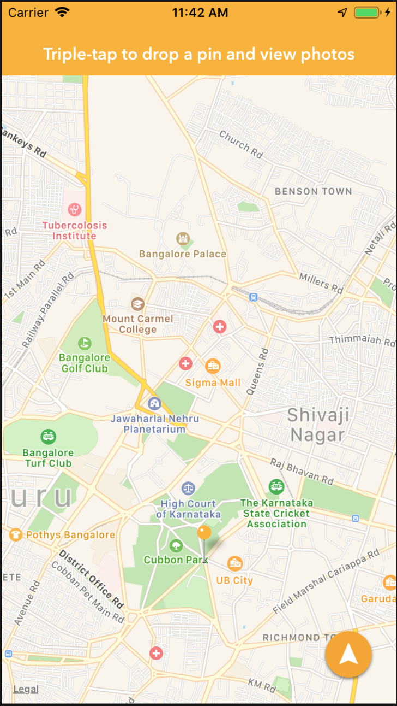
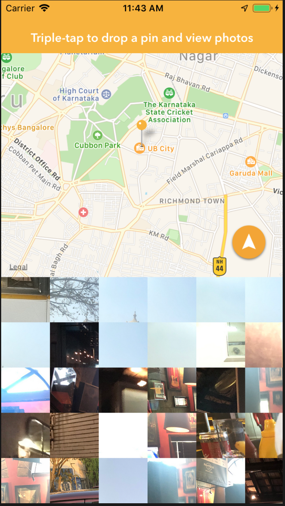
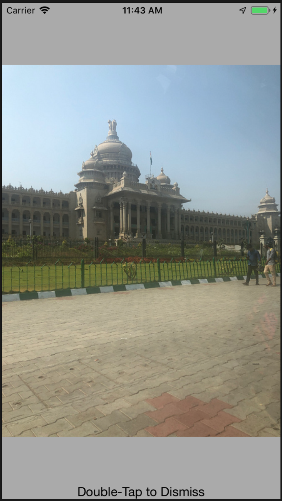

# pixel-city
An app that loads images from a drop-down pin in Map-View

<h3>Pixel-city displays MapView at start, User can Triple-taps to drop a pin on a particular location on MapView, 
it loads Images surrounding to the dropped pin location. Pixel-city uses Flickr API to fetch the images.</h3>

 

<table>
 <tr>
   <td>
     <h3>Default Map View</h3>

   </td>
   <td>
     <h3>Images loaded after dropping the Pin</h3>

   </td>
 </tr>
   <tr>
   <td>
     <h3>When user clicks on a Image</h3>

   </td>
   <td>
   </td>
 </tr>
</table>

<ul>
  <li>Implements 3D touch</li>
  <li>User can use 3D touch when the loaded images are displayed.</li>
  <li>This lets users to get a peek of the image.</li>
  <li>Implements MapKit</li>
  <li>Flickr API</li>
</ul>
